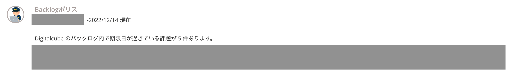
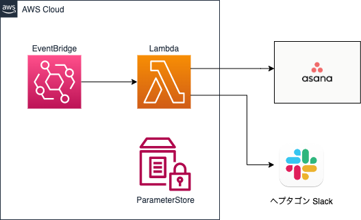
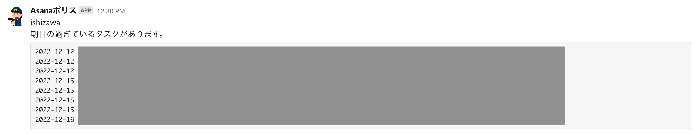

[**デジタルキューブ＆ヘプタゴン Advent Calendar 2022**](https://qiita.com/advent-calendar/2022/digitalcube-heptagon) 12/18の投稿です。  
  
デジタルキューブと一緒になったことでいろいろと情報交換を行なっているのですが、その中でTypetalk内に `Backlogポリス` なるBotを見つけました👀



ヘプタゴンでは[Asana](https://asana.com/ja)をタスク管理に利用しているのですが、これはAsanaポリスが欲しいなー!と思ったので作ってみました。

## コードと構成

https://github.com/youyo/asana-police



定期的に実行されるLambda内でAsanaのAPIを叩き、通知対象タスクを取得してSlack通知するだけなので構成もシンプルです。

リポジトリ内にはいろいろファイルはありますが、実質 `main.go` , `stacks.go` , `lambda/index.py` の3ファイルが本体です。殴り書き程度なので参考程度に。

- `lambda/index.py`

```python
import asana
import datetime
import slack_sdk
import boto3


class AsanaPolice():
    def __init__(self):
        ssm_client = boto3.client('ssm')
        response = ssm_client.get_parameters(
            Names=[
                '/asana-police/ASANA_TOKEN',
                '/asana-police/ASANA_WORKSPACE_ID',
                '/asana-police/ASANA_PROJECT_ID',
                '/asana-police/SLACK_BOT_TOKEN',
                '/asana-police/SLACK_CHANNEL',
            ],
            WithDecryption=True,
        )
        params = {}
        for param in response['Parameters']:
            params[param['Name']] = param['Value']

        self.client = asana.Client.access_token(params['/asana-police/ASANA_TOKEN'])
        self.project_id = params['/asana-police/ASANA_PROJECT_ID']
        self.workspace_id = params['/asana-police/ASANA_WORKSPACE_ID']
        self.slack_client = slack_sdk.WebClient(params['/asana-police/SLACK_BOT_TOKEN'])
        self.slack_channel = params['/asana-police/SLACK_CHANNEL']

    def get_users(self):
        params = {
            'workspace': self.workspace_id,
        }
        users = self.client.users.get_users(params)
        return list(users)

    def get_expired_tasks(self, users: list):
        incomplete_tasks = []
        yesterday = datetime.datetime.now() - datetime.timedelta(1)

        params = {
            'workspace': f'{self.workspace_id}',
            'completed_since': yesterday.isoformat(),
        }
        options = {
            'opt_fields': ['name', 'due_on', 'completed'],
        }

        for user in users:
            result = {
                'name': user['name'],
                'tasks': [],
            }

            params['assignee'] = user['gid']

            tasks = self.client.tasks.get_tasks(params, **options)
            for task in tasks:
                if task['due_on'] is None:
                    continue
                if datetime.datetime.strptime(task['due_on'], '%Y-%m-%d') < yesterday:
                    result['tasks'].append({
                        'name': task['name'],
                        'due_on': task['due_on'],
                        'url': f'https://app.asana.com/0/{self.project_id}/{task["gid"]}',
                    })

            incomplete_tasks.append(result)

        return incomplete_tasks

    def post_chat(self, messages):
        for msg in messages:
            self.slack_client.chat_postMessage(
                channel=self.slack_channel,
                text=msg,
            )


def handler(event, context):
    asana_police = AsanaPolice()
    users = asana_police.get_users()
    incomplete_tasks = asana_police.get_expired_tasks(users)

    messages = []

    for task in incomplete_tasks:
        if len(task['tasks']) == 0:
            continue

        msg = f'{task["name"]}\n期日の過ぎているタスクがあります。\n```\n'
        for t in task['tasks']:
            msg = msg + f'{t["due_on"]} {t["name"]} {t["url"]}\n'
        msg = msg + '```'
        messages.append(msg)

    asana_police.post_chat(messages)
    return True


if __name__ == '__main__':
    result = handler(None, None)
    print(result)
    # import json
    # print(json.dumps(result))
```

基本的なことですが、Tokenなどの秘匿情報は直書きせずにSecretsManagerやParameterStoreを利用するようにしましょう。  
僕はParameterStoreが好きなので使ってます。  
ParameterStore周りはCDK管理外として手動ポチポチで作成しています。適材適所です。  
  
AsanaのAPIを利用する際には[公式SDK](https://github.com/Asana/python-asana/)を利用すると楽です。[Slack](https://github.com/slackapi/python-slack-sdk)も同様です。

---

- `stacks.go`

```go
package main

import (
	"github.com/aws/aws-cdk-go/awscdk/v2"
	"github.com/aws/aws-cdk-go/awscdk/v2/awsevents"
	"github.com/aws/aws-cdk-go/awscdk/v2/awseventstargets"
	"github.com/aws/aws-cdk-go/awscdk/v2/awsiam"
	"github.com/aws/aws-cdk-go/awscdk/v2/awslambda"
	"github.com/aws/aws-cdk-go/awscdk/v2/awslogs"
	"github.com/aws/constructs-go/constructs/v10"
	"github.com/aws/jsii-runtime-go"
)

type StackProps struct {
	awscdk.StackProps
}

func NewStack(scope constructs.Construct, id string, props *StackProps) awscdk.Stack {
	var sprops awscdk.StackProps

	if props != nil {
		sprops = props.StackProps
	}

	stack := awscdk.NewStack(scope, jsii.String("AsanaPolice"), &sprops)

	f := awslambda.NewDockerImageFunction(stack, jsii.String("Lambda"), &awslambda.DockerImageFunctionProps{
		Code: awslambda.DockerImageCode_FromImageAsset(
			jsii.String("lambda/"),
			&awslambda.AssetImageCodeProps{},
		),
		Architecture: awslambda.Architecture_ARM_64(),
		Timeout:      awscdk.Duration_Minutes(jsii.Number(1)),
		MemorySize:   jsii.Number(256),
		LogRetention: awslogs.RetentionDays_TWO_WEEKS,
	})
	f.Role().AddManagedPolicy(
		awsiam.ManagedPolicy_FromAwsManagedPolicyName(jsii.String("AmazonSSMReadOnlyAccess")),
	)

	rule := awsevents.NewRule(stack, jsii.String("ScheduleRule"), &awsevents.RuleProps{
		Schedule: awsevents.Schedule_Cron(&awsevents.CronOptions{
			Minute:  jsii.String("0"),
			Hour:    jsii.String("0"),
			WeekDay: jsii.String("TUE,THU"),
		}),
	})
	rule.AddTarget(
		awseventstargets.NewLambdaFunction(f, &awseventstargets.LambdaFunctionProps{}),
	)

	return stack
}
```

CDKって本当にコード量が少なくていいですね！  
goで書いてるのは単純に僕がgoを好きだからです。(じゃあなぜlambdaはpythonで書いてるんだい?って話ではある)

## 結果



ちゃんと管理していないタスクが炙り出されて全員に共有されるようになりました...!!!  
これを機にしっかりタスク管理していきたいと思います。