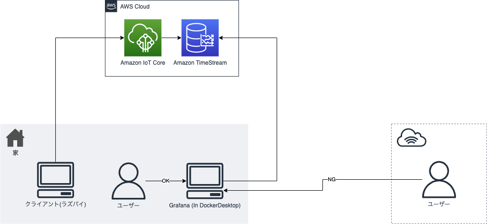

自宅の温湿度や消費電力などのメトリクスをAWS上(Amazon Timestream)で管理しています。それを可視化するにあたってGrafanaを自宅PC(windows)のDockerDesktop環境に作成していたのですが、少し問題がありました。
- 自宅ネットワーク以外からGrafanaにアクセスできない
- windows updateでPC再起動してそのときうまくコンテナが立ち上がらないことがある(謎)

コンテナが立ち上がらないことがあるのは見たいときに立ち上げ直せばいいだけなのでまぁいいのですが、自宅ネットワーク以外からアクセスできないのは不便さを感じていました。  
なのでCloudRunとPlanetScaleを使ってどこからでもアクセスできる環境を用意しました。


## 構成

#### Before



---

#### After


## PlanetScale

https://planetscale.com/

サーバーレスDB。  
GrafanaはデータベースとしてデフォルトではSQLiteを利用しますが、CloudRun環境でローカルストレージの利用はできないので外部データベースとしてPlanetScale(MySQL)を利用します。

PlanetScaleについてはこちらの記事が参考になります。  
ref: https://qiita.com/tak001/items/cfbaa9dcb542929ff235

## CloudRun

>Cloud Run は、Google のスケーラブルなインフラストラクチャ上でコンテナを直接実行できるマネージド コンピューティング プラットフォームです。

ref: https://cloud.google.com/run/docs/overview/what-is-cloud-run?hl=ja

今回はCloudRun上でGrafanaを実行します。

## ソースコード

https://github.com/youyo/grafana-cloudrun-planetscale

と言っても大したものもなくDockerfileがあるだけです。

```Dockerfile
FROM grafana/grafana-oss:9.0.7
ENV TZ=Asia/Tokyo

# Grafana config
ENV GF_LOG_MODE=console
ENV GF_DATABASE_TYPE=mysql
ENV GF_DATABASE_NAME=grafana_cloudrun_planetscale
ENV GF_DATABASE_SSL_MODE=skip-verify
ENV GF_DATABASE_CA_CERT_PATH=/tmp/BaltimoreCyberTrustRoot.crt.pem
ENV GF_DATABASE_HOST=wpaazg9z5ov8.ap-northeast-2.psdb.cloud
ENV GF_LIVE_MAX_CONNECTIONS=0
ENV GF_INSTALL_PLUGINS=grafana-timestream-datasource
#ENV GF_DATABASE_NAME
#ENV GF_DATABASE_USER
#ENV GF_DATABASE_PASSWORD

RUN wget -O /tmp/BaltimoreCyberTrustRoot.crt.pem https://www.digicert.com/CACerts/BaltimoreCyberTrustRoot.crt.pem

EXPOSE 3000
```

気をつけるのはこれくらい。

- PlanetScaleの接続情報はSecretManagerに入れて参照してる(CloudRunデプロイ時に環境変数として展開してる)
- PlanetScaleへの接速にはTLS接続が必要となるので適当に証明書取ってきて設定してる
- デフォルトで[Grafana Live](https://grafana.com/docs/grafana/latest/setup-grafana/set-up-grafana-live/)が有効。うっかりブラウザ閉じ忘れるとしっかりコネクション張り続けてインスタンスが起動しっぱなしになってお金かかって悲しい思いをするので、必要ない場合は無効にする(`max_connections=0`)

CloudRunやPlanetScaleの設定周りは適当にやって終了。  
あとIAPとHTTPSロードバランサーを使ってGrafanaの認証の前にもう一つ認証も入れていた。(構成図に書くの忘れてたので省略)  

これで無事どこからでもアクセスできるGrafana環境が出来上がりました:slightly_smiling_face: 