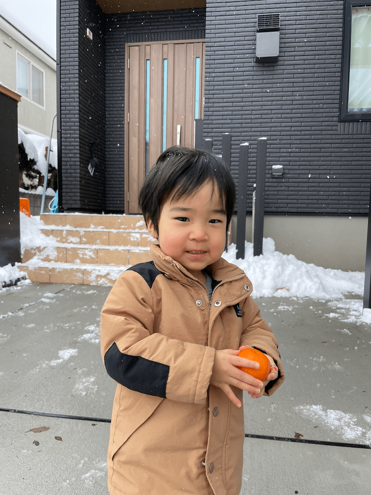

## 仕事

#### (Terraformも含めて)コードばかり書いていた一年だった
- 少し前まではそうじゃないこともしてたと思う
- 社員が増えてきたし昔ほど何でもかんでも自分でやるフェーズではなくなった

#### Lambda+DynamoDBでのBackend APIの構築案件が多かった
- 結構もうお腹いっぱいだな~って思ってたけど、アレはもうちょっと上手くやれたよな~とか考えるとやっぱり定期的にやっていきたい
- 自社の何かを作りたい

#### オープンソース的な活動は停滞気味
- ありがたいことにissueやpull-requestをもらう事もあるが放置しちゃうこともしばしば。仕事と子育てに忙殺されている。放置してごめんなさい。
- Sorry for leaving issues and pull requests. 
  - https://github.com/youyo/aws-cdk-github-actions/issues
  - https://github.com/youyo/postfix-log-parser/issues

#### イベント類はまったく参加しなかった
- 仕事以外の時間配分を完全に子育て全振りしているので仕方ない。自分の選択。
- 後悔はないし、なんならもっと子供との時間を大切にしていきたい。
- しかしせっかく地元に帰ってきてるわけで、盛り上げたい気持ちもあるので何かしたい。子供が寝る22時以降であれば比較的時間もあるので何かするかも。ただし最近は22時過ぎるともう眠いので悩みどころ。

## 環境

#### 家を建てた
- 去年の6月にふらっと住宅展示場を見に行き、家の完成は8月だったので1年ちょいでやり遂げたことになる。家を建てるというのがこれほど忙しいものとは思っていなかった。完全に準備不足だった。情報収集しながら建築士と家の設計やり取りもしつつ家庭内合意も取るのはまぁ大変だった。大変だった甲斐がありそれなりに満足のいく家が出来上がったので嬉しい。
- 一条工務店のグランセゾンという家を建てた。「家は性能」というキャッチフレーズ通り高気密高断熱な仕上がりだった。夏のエアコン一台での全館空調はまぁ他メーカーでも多いと思うけど、冬の全館床暖房での快適さは想像以上だった。
- 冬寒くて起きれないとか無い。布団も一瞬で出れる。
- ただしデザイン面とかは融通利かないう部分も多いので妥協点もある。勾配天井やりたかった。
- 平屋最高。
- 雪捨てる場所ないんだけどどうしたもんかな~

#### 車を買った
- 今まで乗っていた車がだいぶボロボロになってきてたので買い替えた。
- 車買おうかな~から1ヶ月かからず納車まで行けたので我ながらスピーディだった。
- 子供がある程度大きくなるまでの繋ぎのスライドドアファミリーカー(予算200万)と考えて買いに行ったんだけど、実際にはいい感じの新古車が出てきてコミコミ300万くらいで買った。結果中途半端なもの買うよりも満足度高くなったしとても良かった。

## 子育て

#### 長男2歳9ヶ月
- すっかり会話も上手くなって日々の成長速度に驚かされるばかり
- 息子の中でコレはパパにやってもらう、アレはママ、というように割り振りが決まっているようで、そこが違うと泣き喚くので大変。
- 両親とも小柄かつ早産・低出生体重児で生まれたので今でも周りの子よりもだいぶ小さい。ただそのおかげで抱っこするときの負担は小さいはず。それでもしんどいけど。
- 最近はなんでも自分でやりたいらしいのでやってもらってるけどハラハラがすごい。親の忍耐力が培われている。
- そろそろ2人目も欲しい

# 家族のために来年も頑張る。

