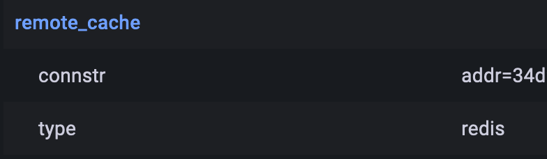
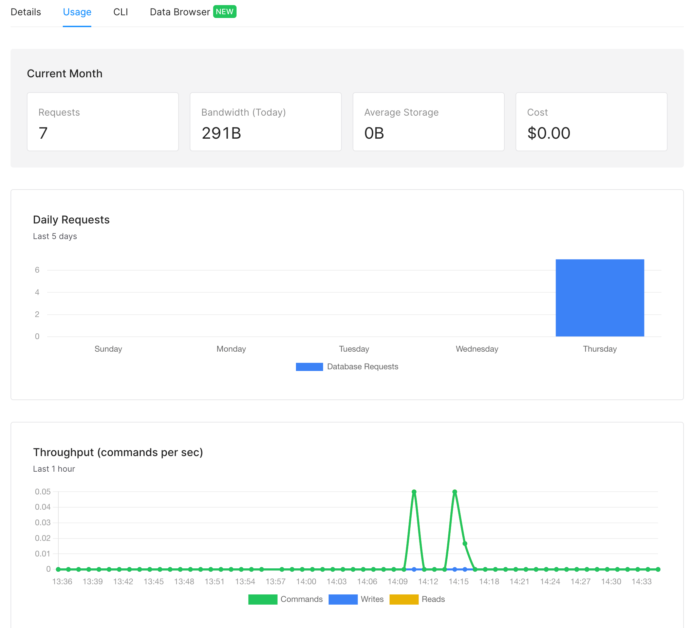

[前回](/post/grafana-cloudrun-planetscale/)PlanetScaleとCloudRunを使ってGrafanaを構築しました。サーバーレスDBであるPlanetScaleですが、それっぽいやつでUpstashというRedisなやつもあります。

https://upstash.com/

どういう特徴があるかなどはこちらが参考になります。  
ref: https://zenn.dev/tkithrta/articles/a56603a37b08f0

Grafanaのセッション管理にUpstash(redis)を使ってみます。別に今の環境でredisを使わなければいけない理由は特にないです。使ってみたいので使うだけです。

## Setup Upstash

アカウント登録をしてドキュメントの通りにデータベース作成を行います。  
ref: https://docs.upstash.com/redis

すぐに接続情報が表示されるので、それをコンテナ内の環境変数`GF_REMOTE_CACHE_CONNSTR`として設定します。PlanetScaleの接続情報と同様にSecretManagerを利用します。

```
GF_REMOTE_CACHE_TYPE=redis
GF_REMOTE_CACHE_CONNSTR='addr=password@example.upstash.io:port,ssl=insecure'
```

## あとはデプロイするだけ

これだけで利用できました:slightly_smiling_face: 



少し待ったらUpstash側でもメトリクス確認できました。

